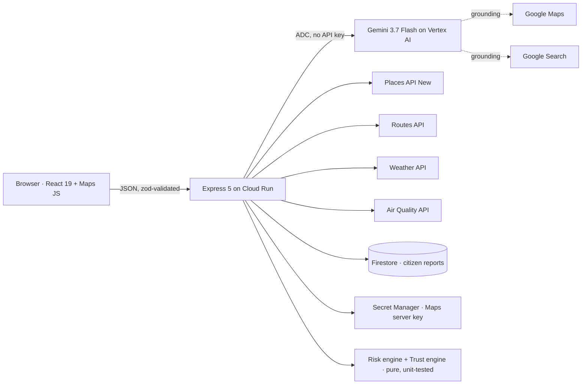

# Sahayatri: verified city co-pilot for Pune

> **सहयात्री (Sahayatri) means "fellow traveller."** Pune can be chaotic: misal queues, the Katraj–Navale slope, monsoon waterlogging. Sahayatri turns scattered city data into **verified, actionable** insights for exploring, staying safe and getting around.

**Live:** https://promptwars-app-419768914856.asia-south1.run.app · Built for **PromptWars × BRAIN DYPCOEI** (Google for Developers × Hack2skill)

---

## Why it's different

Google Maps can already answer "where should I eat?". Sahayatri adds the layer it does not have, **trust and safety**:

1. **Every AI answer is grounded and verified.** Gemini answers with *Grounding with Google Maps* (and Google Search for heritage). Each suggested place is then checked against the **Places API**, so the map only shows real, located places, each with a live area-safety score.
2. **Safety routing uses real Pune data, not just opinions.** Alternative routes from the **Routes API** are scored against **17 official accident black spots** (Pune City and Traffic Police lists; the Katraj→Navale slope saw 8 deaths in Nov 2025), live verified citizen reports, night-time risk and live **Weather API** rain. Every point of risk is explained.
3. **Citizen reports are cross-checked, not taken on faith.** Research on crowdsourced civic data shows that AI alone is a weak verifier. Sahayatri uses Gemini's multimodal judgement as **one** signal among several: photo evidence, live weather, independent nearby reports and official hotspots. Together they produce a transparent **Trust Score**: *Unverified → Corroborated → Verified*.
4. **It speaks Pune.** Voice notes in **Marathi, Hindi or English** (including Hinglish) are transcribed, translated and structured, then routed to the right Pune helpline (Traffic 1095, PMC Disaster Cell, 112, MSEDCL 1912).

## Problem statement coverage

| Requirement | Where it lives |
|---|---|
| Exploration & Hospitality | **Explore** tab: food, stays and budget spots via Gemini + Maps grounding, verified with Places (rating, ₹ budget, best time, safety note) |
| History & Culture | **Explore → Heritage stories**: Maps + Search grounded stories, landmarks and traditions |
| Safety & Security | **Safe Route**: black spots, verified reports, night and rain, with Safest / Fastest / Balanced tags and plain-language precautions |
| Best vs Worst | **Compare**: radar plus scores for safety, cleanliness, affordability, rating and accessibility, with **quoted review evidence** |
| Smart City Insights | **City Pulse** (live weather, AQI, Search-grounded daily briefing) plus **Report** (photo, voice and text → verified incident on the shared map) |

## Architecture



- **`server/`**: Express 5 + TypeScript. Each feature is a small router (`routes/`). The pure scoring logic (`services/risk.ts`, `services/trust.ts`) is deterministic, and each of its rules has focused unit tests. External services sit behind interfaces (`AiClient`, `MapsClient`, `ReportStore`), so tests run with fakes.
- **`web/`**: React 19 + Vite + Tailwind v4 + Motion, with `@vis.gl/react-google-maps` for the map. Two pages: a landing story (`/`) with a Devanagari **सहयात्री** wordmark set in *Yatra One*, and the co-pilot (`/app`). The soft-premium UI uses Outfit + Instrument Serif, sunflower and charcoal colours, semicircle score gauges, and a warm monochrome map with accessible HTML markers (real `<button>`s). The chart bundle is code-split.
- **One container** serves both on Cloud Run (`asia-south1`).

### Google services used (12)

Gemini on **Vertex AI** · **Grounding with Google Maps** · **Grounding with Google Search** · **Places API (New)** · **Routes API** · **Weather API** · **Air Quality API** · **Maps JavaScript API** (Advanced Markers) · **Firestore** · **Secret Manager** · **Cloud Run** · **Cloud Build / Artifact Registry**

## Prompt and AI design

- **Structured output everywhere.** Each Gemini call sends a JSON Schema generated from a **zod** schema (`responseJsonSchema`), and the response is **validated again** server-side. Model output is never trusted blindly.
- **Grounding over guessing.** The prompts forbid inventing places, prices or events. Explore uses Maps grounding with the user's lat/lng; Heritage and City Pulse add Search grounding. Sources are returned to the UI.
- **The deterministic core decides, Gemini explains.** Route safety scores are computed by code; Gemini only explains them, so a model hallucination can never change a safety score. If Gemini is down, routes still work.
- **Prompt-injection guard.** All user text is wrapped in `<user_input>` tags (with `<` neutralised) and treated as data by the system prompt.
- **Task-specific temperatures.** 0.2 for extraction and comparison, 0.3 for explanations, 0.4 for recommendations.

## Security

- **No AI key exists.** Gemini is called through Vertex AI with the Cloud Run service account (ADC).
- The Maps server key lives in **Secret Manager** and is limited to Places, Routes, Weather, Air Quality and Geocoding. The browser key is limited to the Maps JS API **and** to the app's HTTP referrers.
- Helmet with a strict CSP (Google's official Maps allowlist, `object-src 'none'`, `frame-ancestors 'none'`), `nosniff`, HSTS, and no `x-powered-by`.
- All input is validated with zod, including media MIME allowlists, a base64 check and size caps (~5 MB). Photos are downscaled in the browser.
- Rate limiting (40 req/min/IP on `/api`), a 12 MB body cap, and upstream errors mapped to generic messages with no internals leaked.
- The container runs as a non-root `node` user with production dependencies only.

## Accessibility

- Semantic landmarks and a skip link. The tabs follow the WAI-ARIA pattern (arrow keys, Home and End).
- Every input is labelled, results are announced through `aria-live`, and score rings and bars carry `role="img"` / `role="meter"` with text values.
- AA-contrast "ink" variants of the Google colours, visible focus rings, and `prefers-reduced-motion` respected (Motion `reducedMotion="user"` plus a CSS fallback).
- The map has a legend, and every map feature is also listed in text.

## Efficiency

- Weather and AQI are cached for 10 min per area, and the city briefing for 20 min. Places and Routes calls use tight **field masks**.
- Independent upstream calls run in parallel. Responses are gzip-compressed, and static assets are cached.
- Cloud Run scales to zero, with concurrency 40.

## Testing

```bash
npm test          # server (vitest + supertest) + web (vitest + Testing Library)
```

There are **43 tests** covering geo maths and polyline decoding, the risk engine (black spots, night, rain, report trust filtering, tagging), the trust engine (each signal, the caps and clamping), every API route with fake Gemini and Maps (validation, the 502 mapping, AI-down fallback, corroboration upgrading a report to *Verified*, security headers, rate-limit headers), the prompt-injection wrapper, and the UI (tabs, keyboard navigation, labels, disabled states).

## Run locally

```bash
npm install
gcloud auth application-default login          # Vertex AI via ADC
cp .env.example .env                           # add Maps keys
npm run dev:server   # :8080
npm run dev:web      # :5173 (proxies /api)
```

## Deploy

```bash
bash scripts/deploy.sh   # Cloud Build → Cloud Run, Maps key from Secret Manager
```

## Data sources

Black spots come from the Pune City Police Road Safety Report 2024–25, the Pune Traffic Police black-spot lists (2022, 2023) and the Pune district Road Safety Committee (2026). Coordinates are approximate (±150 m). Live data comes from Google Maps Platform. In an emergency, call **112**.
